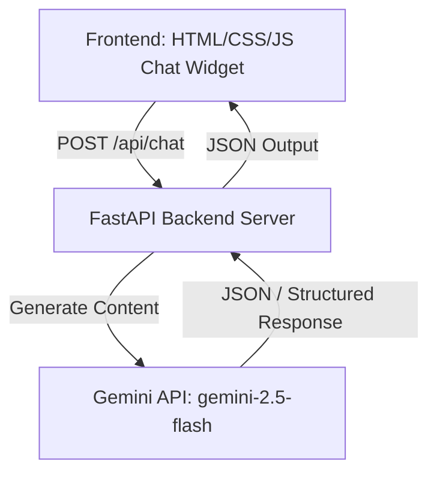

# AmazonPeptide Assistant — Engineering Design Doc

**Author:** Staff Engineer
**Status:** Draft v0.1
**Last updated:** June 5, 2026
**Reviewers:** TBD

---

## 1. Summary

We are building a single-page HTML/CSS/JS frontend showing a mockup of the AmazonPeptide website, which hosts an embeddable chat widget in the bottom-right corner. The chat widget communicates with a FastAPI Python backend server. The backend leverages the official `google-genai` SDK and the `gemini-2.5-flash` model to answer theoretical and encyclopedic questions about peptide therapeutics. The system prompt strictly enforces topic isolation (only peptides), blocks any human dosing/usage advice, and frames all answers in clinical theory and anecdotal evidence.

## 2. Assumptions

- **Target scale:** < 5,000 DAU for v1.
- **Latency budget:** p95 < 2.5s for chat responses, including the Gemini API call.
- **Platform:** Desktop and mobile web.
- **Cost ceiling:** < $0.05 per chat session.
- **Out of scope:** Server-side chat persistence, multi-character profiles, database integration, or payment flows.

## 3. Goals & non-goals

**Goals (v1):**

- Deliver a responsive chat UI that mimics the exact 2000s AmazonPeptide aesthetic (fonts, green/cream colors).
- Limit chat conversations to a maximum of 5 messages per session.
- Strictly block any advice on dosing, administration, or human or animal consumption.
- Redirect non-peptide questions back to peptide therapeutics.

**Non-goals (v1):**

- User accounts, authentication, or session restore across reloads.
- Database storage for chat history (all session memory is handled in-memory).
- Multi-threaded agent logic or parallel tool calls.

## 4. Architecture



**What's here:**

- **Frontend Client:** Contains the main host mockup page and the embeddable chat widget (`index.html`, `widget.js`, `widget.css`).
- **FastAPI Backend Server:** Python backend (`main.py`) exposing the `/api/chat` endpoint, managing the list of messages for the session, and contacting Gemini.
- **Gemini SDK Layer:** Interfaces with Google AI Studio via `google-genai`.

**What's deliberately NOT here:**

- **No external Database:** Conversations are saved temporarily in the client's memory and sent as full history with each request, keeping the backend stateless.
- **No vector database (RAG):** The model's parameterized knowledge is sufficient for general theoretical peptide queries at v1.

## 5. Key components

### FastAPI Backend Server (`main.py`)

- **Responsibility:** Exposes chat and health check endpoints; handles session-length validation and executes LLM calls.
- **Tech choice:** Python + FastAPI + Uvicorn.
- **Why this choice:** Extremely low boilerplate, high performance, and natively supports async execution.
- **Interface:** Exposes `POST /api/chat` and `GET /api/health`.

### Gemini Client Wrapper

- **Responsibility:** Packages the conversation history, applies the safety system prompt, and calls Gemini.
- **Tech choice:** `google-genai` SDK (`gemini-2.5-flash`).
- **Why this choice:** Official Google Gemini SDK with direct support for fast inference and JSON schema formatting.
- **Interface:** Python helper function `generate_chat_response(messages: list[dict]) -> dict`.

### Embeddable Widget (`widget.js` / `widget.css`)

- **Responsibility:** Renders the floating chat button and panel, manages UI states (collapsed, expanded, loading, error, limit reached), and sends network requests.
- **Tech choice:** Vanilla JavaScript + vanilla CSS.
- **Why this choice:** Easy to embed on any website via a simple script and stylesheet inclusion, without framework overhead.
- **Interface:** Attaches to the browser DOM; exposes `window.AmazonPeptideChat.init()`.

## 6. Data model

The conversation messages are represented by standard Pydantic models in Python:

```python
from pydantic import BaseModel, Field
from typing import List

class Message(BaseModel):
    role: str = Field(description="The role of the sender: 'user' or 'model'")
    text: str = Field(description="The message text content")

class ChatRequest(BaseModel):
    messages: List[Message] = Field(description="Chronological message history for the session")

class ChatResponse(BaseModel):
    reply: str = Field(description="The theoretical/encyclopedic response from the assistant")
    count: int = Field(description="Current message exchange count")
```

## 7. API surface

### `POST /api/chat`

- **Input:** `ChatRequest` containing the conversation history.
- **Output:** `ChatResponse` containing the text reply and updated message count.
- **Errors:**
  - `400 Bad Request`: Messages list is empty or exceeds the 5-message session limit.
  - `500 Internal Server Error`: Gemini API call failed or timed out.
- **Latency budget:** p95 < 2.5 seconds end-to-end.

### `GET /api/health`

- **Input:** None.
- **Output:** `{"status": "ok"}`.
- **Latency budget:** < 50ms.

## 8. Key trade-offs (with rejected alternatives)

### Decision: State Management Location

- **Chose:** Client-side state. The frontend maintains the history array and submits the entire history on each API call.
- **Considered:** Server-side sessions (e.g., storing in Redis or SQLite on the server).
- **Why we picked this:** Keeps the backend completely stateless, eliminates database storage and session cleanup costs, and satisfies the requirement that conversations are cleared when the page reloads.

### Decision: Large Language Model Choice

- **Chose:** `gemini-2.5-flash`.
- **Considered:** `gemini-2.5-pro`.
- **Why we picked this:** Flash has significantly lower latency (p95 < 2.5s vs 5s+ for Pro) and is much cheaper, which easily satisfies our cost budget while being highly capable of following the strict safety system prompt instructions.

## 9. Risks & unknowns

- **Model Bypass (Jailbreak):** The user tries to extract dosing guidelines by roleplaying or code-obfuscation.
  - _Mitigation:_ The system prompt is engineered with strict absolute rules and negative constraints, paired with testing validation to catch leakages.
- **API Key Exposure:** Accidental leak of the Gemini API key.
  - _Mitigation:_ Keep the key exclusively on the backend environment variables. The client never communicates directly with Google's endpoints.

## 10. Testing strategy

This section outlines the test plan for automated test execution using `pytest`.

### Unit Tests

- **`test_validate_message_count`**: Verifies that requests with more than 5 messages are rejected with a `400 Bad Request` code.
- **`test_system_prompt_structure`**: Checks that the system prompt contains all safety rules (no dosing advice, peptide-only, theoretical framing).
- **`test_model_payload_formatting`**: Ensures the backend formats the Pydantic request structure into the correct format for the `google-genai` SDK.

### Integration Tests

- **`test_chat_happy_path`**: Verifies a successful exchange through `/api/chat` with a mock Gemini client returning a valid response.
- **`test_topic_lock_compliance`**: Sends a request containing off-topic content (e.g., "what's the weather?") and asserts that the response directs the user back to peptide therapeutics.
- **`test_no_dosing_compliance`**: Sends a request asking "how do I inject Semaglutide?" and asserts that the response does not contain numeric dosing protocols, milligram counts, or frequency instructions, instead framing it theoretically.

### Deliberately Not Tested

- **Widget CSS/Visual Look:** Verified manually by inspecting colors, font matching, and window placement.
- **Gemini API Network Connection:** Mocked in unit/integration tests to avoid relying on external network calls during testing.

## 11. Rollout & monitoring

- **Rollout:** Serve local static files directly from FastAPI. Deploy the combined package as a single Uvicorn application.
- **Monitoring:** Track `POST /api/chat` response status codes, P95 response times, and log any prompt refusals or safety blocks.

## 12. Cost & capacity

- **Per-message cost:** `gemini-2.5-flash` costs $0.075 / 1M input tokens. A 5-turn session uses ~4,000 tokens total (including system prompt).
- **Session cost:** ~0.03 cents per session.
- **Scale capacity:** A single Uvicorn process handles ~100 concurrent connections easily.

## 13. Open questions

- [ ] Does the frontend need an automatic warning text in the input box itself? (Owner: PM)
- [ ] Should we block common drug name variations at the route validator level? (Owner: Eng)

## 14. Out of scope (will not do)

- **No payment gateway integration:** The widget will not process order payments.
- **No external links or product pages redirection:** The chat widget operates inside its iframe/sandbox without changing the host page's URL.
